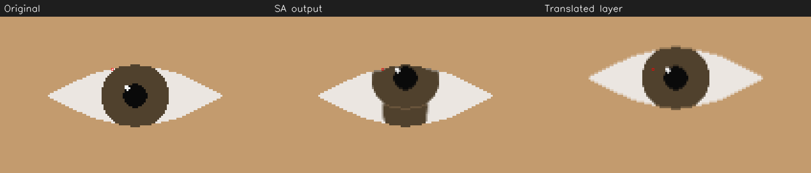

# M3 implementation stop: layered blend versus required no-ghosting test

Date: 2026-09-05. Status: **M3 IMPLEMENTATION BLOCKED**.
This is an implementation finding, not an amendment to the frozen SA and
not a Product Owner visual-gate verdict. No M3 PASS is claimed.

## Provenance and scope

- Remote state fetched before code changes.
- Canonical SA verified: `m3-architecture-v1` at
  `a459e6be36122bf10ce707731d5f847007847e96`.
- Implementation branch: `codex/m3-gaze-correction`.
- Base: assignment commit `06c9c5926fde425c49c3776f5bfd110df18a9538`,
  directly above the canonical SA.
- The PRD, assignment, architecture, accepted ADRs, SA and QA policy were
  read. No frozen product code, existing tests, dependency declarations or
  architecture documents were edited. Existing untracked virtual
  environments were preserved; no environment was rebuilt.
- Partial implementation only: ROI mask/distance, background remap, rigid
  iris layer and blend helpers, synthetic fixture, targeted tests.
  Engine contract/orchestration, policy, offline CLI and PO batch remain
  unimplemented because the assignment requires stopping on a genuine SA
  conflict. No M4 work was started.

## Problem

SA sections 8.1 and 8.4 prescribe an inward blend alpha and this composition:

```text
composed = iris_alpha * iris_layer + (1 - iris_alpha) * background
output = alpha * composed + (1 - alpha) * original
```

SA section 15.2, "no ghosting near the lid", requires that pixels with
`iris_alpha == 1` and `0.5 < alpha < 1` equal the translated source iris
within interpolation tolerance, without mixing the unmoved original.

At these pixels the prescribed formula reduces to
`output = alpha * iris_layer + (1 - alpha) * original`. It necessarily
retains original content wherever original and translated pixels differ.
The formula and the required property cannot both hold generally.

## Evidence

The reproduction uses the frozen M2 `gaze_scene` geometry and real geometric
gaze estimator with smoothing off. The realistic-anatomy fixture has 90 px
eye width, aperture 0.25 and iris radius 17.55 px (0.39 of half-width).
Both source gaze angles are 0 degrees, status ESTIMATED, confidence 1.0.
The move is the SA's frontal 15-degree upward mapping at effective strength
1: `dy = -(45 / 1.25) * sin(15 degrees)`, approximately -9.317 px.
This is the prescribed section 15.2 stress case, not a PO operating-range
quality judgment.

The eye is valid. Destination center clearance from the analytic polygon
is 6.312 px, exceeding the required 2.632 px margin. Thus containment does
not exclude the case. Rasterization uses fillPoly with 8 shift bits,
DIST_MASK_PRECISE, guard 1.5, linear remapping and edge width 1.5.

Measured on Windows, Python 3.12.10, NumPy 1.26.4, OpenCV 4.11.0,
pytest 9.1.1, using the existing `.venv-m1-qa-r2` environment:

- 40 pixels satisfy the required non-vacuous partial-alpha test region.
- 22 of those pixels differ from the translated layer by more than 2
  channel levels; maximum difference is **60/255**.
- One witness, ROI-local `(x=58, y=27)`: alpha 0.6666667, iris alpha 1.0;
  original BGR `(225,230,235)`, translated iris `(45,65,80)`, output
  `(105,120,132)`. The difference is the required original mixing, not
  interpolation disagreement: comparison uses the very same sampled layer.
- The required wide-feather negative control (`edge_px=4`) also ghosts.
- Alpha bounds, exact outside-opening preservation, default bilinear
  footprint containment and zero-area rejection pass.

Reproduce from the repository root in PowerShell:

```powershell
.\.venv-m1-qa-r2\Scripts\python.exe -m pytest tests/test_correction_masks.py -q
```

Result: **1 failed, 3 passed**. The failing test is deliberately neither
skipped nor marked xfail. Weakening it would silently change the frozen
acceptance requirement.



The red box marks the witness pixel. The translated-layer panel is an
intermediate sampling reference, not a proposed output. This generated
synthetic diagnostic contains no webcam capture and is not a PO gate sheet.

## Options and trade-offs

1. **PM-authorized narrow compositing revision:** keep the opaque iris
   contribution outside the final original-frame feather, preserving
   source/destination opening occlusion. This can address the exact
   property while retaining the engine boundary and copy budget, but
   changes the frozen section 8.4 formula. Lid-edge aliasing and partial
   source coverage would need targeted verification. No revised algorithm
   has been implemented or claimed verified.
2. **PM-authorized test/quality revision:** retain the formula and explicitly
   accept bounded original mixing at the partial-alpha edge, using a
   defensible criterion plus the PO visual gate. This minimizes code
   changes, but relaxes the frozen no-ghosting requirement; a tolerance
   must not be chosen merely to make this reproduction pass.
3. **Tune edge width to 1:** permitted as an experimental constant, but the
   binary precise distance field then has no partial-alpha pixels. This
   makes the specified test empty rather than meeting it, and introduces
   a harder edge. It does not resolve the requirement conflict.

## Recommendation and stopping decision

**BLOCKED.** Request a narrow PM decision on option 1, with an explicit
revision of the affected formula/test before implementation resumes.
This finding alone does not establish that the geometric approach fails
the product quality gate and does not justify beginning neural work or M4.
Implementation stopped on the first confirmed conflict, as requested.

## Verification and remaining limitations

- **FAILED — targeted tests:** 3 passed, 1 failed (the conflict above).
- **FAILED — full regression, one run:** 664 passed, 2 failed, 14 skipped
  in 74.75 seconds. Besides the new no-ghosting test, the unchanged
  `tests/test_tracking_runtime.py::test_tracker_failures_never_interrupt_the_original_preview`
  timed out after 3 seconds waiting to observe ERROR; its last five
  observations were TRACKED. The injected inference exception was logged.
  Cause and reproducibility are not established. No frozen tracking code
  or test was modified, and no full-suite rerun or unrelated investigation
  was undertaken after the architecture stop. Local raw log:
  `.git/m3-regression.log` (not committed).
- **VERIFIED — static/import checks:** compileall on the new Python files,
  import of the mask module and git diff whitespace checks. The mask
  library imports only stdlib, NumPy and OpenCV; the complete boundary
  suite cannot exist until the remaining engine modules exist.
- **VERIFIED, limited — geometry/mapping:** the synthetic frontal
  15-degree case, analytic destination clearance and default bilinear
  footprint check. Full closed-loop, head-rotation, pair-rule and
  size-scaling verification: **NOT VERIFIED**.
- **VERIFIED, limited — ownership:** mask-helper sampling preserves its
  source; blending preserves outside-opening pixels. Full-frame copy-once
  and engine exception/fallback semantics: **NOT VERIFIED**, engine absent.
- **NOT VERIFIED — real-model correction and PO visual quality:** no
  completed harness, no PO captures processed, no gate performed. The 14
  existing opt-in real-model tests were skipped by their normal guard.
- **NOT MEASURED — performance:** correction/compositing latency and
  percentiles, copy cost, resource use and live FPS. Test duration is not
  a performance benchmark; no M4 throughput is inferred.

ADR-0002/0003 and provider-neutral boundaries are preserved by the partial
library, but full engine conformance is **NOT VERIFIED**. No live pipeline,
threading, settings or dependency changes exist. All six canonical frozen
remote references still match the assignment; frozen PRD/architecture/ADR/SA
content is unchanged. Existing local `main` and `milestone-0` refs were
already older than their canonical remote refs and were left untouched.

## Product Owner evaluation after the block is resolved

Do not start scoring the partial implementation. Once the completed engine
and harness are ready, perform the frozen SA's single 45–50 minute session:

1. In normal lighting, use an external Camera application at native 720p.
   Verify mirroring once with readable text or a marked hand.
2. Put eight stills in local `experiments/inputs/`: looking at lens, screen
   center, lower-edge notes and horizontally away, each with/without glasses.
   Add three 5–10 second screen-center clips: speaking/smiling, minor head
   rotation, and blink/wink/squint/closed eyes.
3. The engineer processes all inputs at defaults in one documented batch,
   applying unmirror if needed, and prepares eight comparison sheets and
   three corrected clips with reports. PO imagery remains local.
4. Score the section 14.2 dimensions at 100% and in the 3x eye strip; answer
   whether correction is less distracting than the original. Record clip
   temporal behavior as notes. Evaluate the 10–20 degree range at effective
   strength 0.5–0.8 where represented; do not manufacture missing coverage.
5. Record experiment names, settings, tested SHA and PO judgments in
   `docs/milestones/m3-evaluation.md` at evaluation time. The PM determines
   PROCEED, ITERATE or CHANGE APPROACH. M4 requires a separate assignment.
