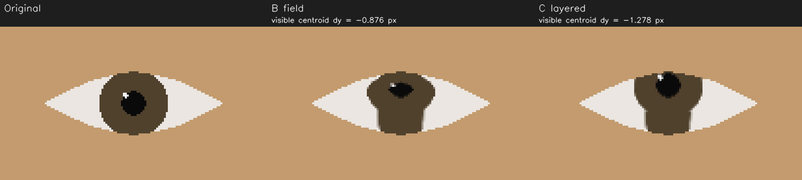

# M3 SA v1.1 implementation handoff — blocked on visible-iris displacement

Date: 2026-09-05. **M3 IMPLEMENTATION BLOCKED**. Recommendation: **BLOCKED**.
The A1 amendment is implemented and its tests pass. This report escalates a
separate conflict between the prescribed warp and frozen section 15.2
visible-iris displacement requirements. No M3 PASS, PO quality verdict or
M4 readiness is claimed.

## Repository state and migration

Remote state was fetched before work resumed. Verified canonical references:

| Reference | SHA |
| --- | --- |
| `m3-architecture-v1.1` | `00eed0e893b73dcd490f69af8df852a0609ccbaa` |
| Active assignment/base, `codex/m3-assignment-v1.1` | `42fc15b3f54f130d7db7cb4078a91ed529281d1c` |
| Original partial implementation, preserved | `7916bd57e92893b2814213f8330b409f80505ccc` |
| Rebased partial implementation | `598d7abb77f04cc07a0da862f3b3923f66323470` |
| Resumed code/tests, tested contents | `5fc1454c3929e563dfbded7b4550d3fd1adda201` |

Implementation remains on `codex/m3-gaze-correction`. The original commit is
also retained by `codex/m3-pre-v1.1`; migration rebased its single change
onto the updated assignment without conflicts or discarding work. The final
documentation/evidence commit follows the tested code commit. No remote was
pushed, no PR was merged, and no frozen reference was advanced.

All seven frozen canonical remote references remain at their assignment
SHAs. PRD, architecture, accepted ADRs and frozen SA content compare unchanged
against v1.1. The active assignment matches its supplied commit. Frozen
M0–M2 product code and tests are unchanged. The script registration and
ignored experiments directory are the only changes to existing project
configuration; dependencies are unchanged. Existing untracked virtual
environments remain untouched.

## Implemented

- Preserved the original mask library and fixture work.
- Implemented A1's base-first/iris-second blend order, with binary destination
  coverage and conservative all-four-bilinear-taps source coverage.
- Added metadata-only frozen models, protocol/factory, analytic eye geometry,
  relative inverse-M2 mapping, pure correction policy and geometric engine.
- Added ordered frame/eye gates, pair behavior, no-op/reset/closed behavior,
  validate-before-copy, complete-frame fallback on rendering exceptions,
  timings and small optional debug metadata.
- Added local-file harness, script/console entry point, image sweeps, debug
  overlays, source SHA-256 reports, per-frame JSONL, repeated timing samples,
  prerecorded video processing and per-stream PNG codec fallback.
- Added hardware-independent tests and an opt-in real-model correction test.
  Added `docs/correction.md` as the implementation reference.

Implementation and verification stopped at the confirmed conflict. Remaining
geometry matrix cases, full visual experiment matrix, PO batch preparation
and final implementation self-review are not represented as complete.

## Problem

The frozen SA section 15.2 requires variant C on the realistic-anatomy
fixture at 15 degrees upward to move the visible iris centroid by at least
`0.6 * |d|`, where `d` is the commanded displacement. It also requires tight
horizontal centroid agreement on that fixture. Executing the fixed section
8.2 background field and section 8.4/A1 blend does not reach those bounds.

The source iris is already clipped at the lids in this anatomy. The field
goes to zero at the contour, retaining source-iris content there. Adding a
translated disc over that background does not remove all retained source
iris content. The visible dark region therefore moves much less than the
commanded displacement, although the iris-layer center is translated and
A1's no-ghosting invariant at opaque layer pixels is met.

## Evidence

Fixture: frozen `gaze_scene` with aperture 0.25, half-width 45 px, iris ring
rescaled to radius 17.55 px (ratio 0.39), consistently reflected in the
renderer. The real geometric estimator reports ESTIMATED, source yaw/pitch
0/0 degrees. Target pitch is +15 degrees, effective strength 1, default
engine constants. This is the specified automated stress case, not a
substitute for the PO's 0.5–0.8 operating-strength evaluation.

Commanded image displacement is `(0, -9.317486)` px. Required C centroid
movement is at least **5.590491 px**. Measured on the right eye:

| Variant | Visible centroid dx | Visible centroid dy |
| --- | ---: | ---: |
| B, field-only | -0.035461 px | -0.876425 px |
| C, layered/A1 | +0.008936 px | -1.277607 px |

C improves on B, but reaches only about 14% of commanded displacement,
well below the required 60%. An independent direct calculation using
`fillPoly`, precise distance transform, the written field equation,
OpenCV remap, explicit all-taps source coverage and the written A1 formula
matches the engine ROI **bit-for-bit: maximum channel difference 0** for
both B and C.

This is not sensitive to the chosen dark-pixel threshold: at red-channel
thresholds 100, 130 and 160, C moves vertically 1.277, 1.278 and 1.214 px;
B moves 0.874, 0.876 and 0.831 px. The renderer-centroid sanity test passes.
The original analytical containment check also passes (6.312 px clearance,
2.632 px required margin). No clamp or safety skip prevents the test.

Other failures include realistic horizontal 10-degree C correction:
commanded 6.251 px versus measured approximately 4.914 px, exceeding the
allowed 0.5 px error. The vertical realistic case is the primary escalation
because its gap is large and robust to centroid threshold choice.

Reproduce the primary finding without a camera/model/network:

```powershell
.\.venv-m1-qa-r2\Scripts\python.exe -m pytest tests/test_correction_warp.py::test_realistic_occlusion_layered_exceeds_field -q
```

The failing assertions remain ordinary tests, not skips/xfails. No frozen
threshold was changed to make the implementation pass.



Raw measured fixture values: `m3-v11-centroid-evidence.json`. Synthetic
diagnostics contain no PO images. This evidence establishes an unmet
engineering requirement; it does not establish a qualitative product
verdict for all geometric methods.

## Options / trade-offs / recommendation

1. **PM-authorized narrow SA revision of the background/source-iris
   treatment.** Retain A1, the engine boundary and copy budget, but explicitly
   authorize a bounded rendering experiment that addresses retained source
   iris content. This preserves a meaningful movement requirement and
   targets the observed failure; it changes the settled warp technique and
   could introduce sclera-fill artifacts. No replacement is implemented.
2. **PM-authorized revision of the displacement acceptance test.** Keep the
   exact renderer and assess its smaller visible movement with an explicit
   revised metric and the PO gate. This minimizes code changes but lowers
   the established numeric requirement and may accept visibly ineffective
   correction. Do not set a tolerance merely to fit these numbers.
3. **CHANGE APPROACH after broader product evidence.** Earlier evaluation of
   another correction class may eventually be warranted, but these tests
   alone are not a PO judgment. That is a roadmap/PM decision, not authority
   to start neural work or M4.

**Recommendation: BLOCKED pending a PM decision on option 1.** Keep A1 and
all passing work. Authorize a bounded investigation of the retained iris
content and revise only the necessary settled rendering decision. Do not
silently compensate with gain: the commanded motion is already correctly
mapped, and the deficit is in the rendered visible disc.

## Architecture conformance

- **Frozen SA v1.1:** implemented signatures, geometry/mapping, policy,
  gate order, masks and A1 formulas; numeric visible-displacement acceptance
  **FAILED**. Complete conformance cannot be claimed.
- **ADR-0002:** **VERIFIED at implementation level** — separate engine,
  metadata result, caller policy, engine-internal compositing, replaceable
  protocol/factory and caller exception containment.
- **ADR-0003:** **VERIFIED at implementation level for M3** — one owned
  full-frame copy in the implementation; input object on skip/failure;
  successful writable canvas, no retained frame state. No publication or
  threading changes; those belong to M4.
- **Provider neutrality:** **VERIFIED** by AST import tests. Engine/library
  code imports no backend/UI/camera/pipeline/harness/debug modules. Geometry
  has no OpenCV import; models import contracts/NumPy/stdlib only.
- **M3/M4 separation:** **VERIFIED** by changed-file and import inspection.
  No live correction, continuity epoch, pipeline metrics, workers, UI,
  calibration, virtual camera, neural dependency or future-milestone code.

## Verification

Environment: Windows, existing `.venv-m1-qa-r2`, Python 3.12.10,
NumPy 1.26.4, OpenCV 4.11.0, pytest 9.1.1; no dependency rebuild.

| Check | Evidence | Status |
| --- | --- | --- |
| A1 mask suite | 12 passed, covering all eight A1 regression categories, including non-vacuous old-formula negative control | VERIFIED |
| Engine/models/geometry/policy focused run with initial A1 tests | 48 passed | VERIFIED for tested cases |
| Harness + boundary | 16 harness tests passed; boundary test passed after correcting its test-only import-name check | VERIFIED |
| Visible-iris suite | 7 failed, 4 passed | FAILED |
| Real-model correction, opt-in | 1 passed, two upstream protobuf/Python deprecation warnings | VERIFIED at offline runtime level |
| Full regression, one run | 739 passed, 7 failed, 15 skipped, 41.30 s | FAILED |
| Compilation/import checks and git diff whitespace checks | passed | VERIFIED |
| Frozen references and documents | unchanged | VERIFIED |
| Product Owner visual evaluation | not performed | NOT VERIFIED |

All seven full-suite failures are in the new visible-iris tests. The unchanged
tracking-runtime failure seen in the previous session passed this run; its
intermittence is not investigated or declared fixed. The full suite's 15
skips are opt-in real-model tests; the new real-model test was executed
separately. Local raw full-suite log: `.git/m3-v11-regression.log`.

Mapping verification includes frontal yaw/pitch closed loops at full/half
strength, rotated-head transpose discriminators, signs, scale, clamp and
no-pose branch. Safety/ownership tests cover frame gates, wink/pair behavior,
degenerate/closed contours, realistic containment, repeatability, writable
input preservation and injected failures before rendering, during left-eye
remapping and after the first eye has blended. Bilinear footprint bounds,
outside-opening preservation and helper eye-order independence pass.
The remaining SA test matrix is not fully complete following the stop.

For Q12, a flat-iris/high-contrast-lid probe isolates the iris/lid step from
unrelated pupil/catchlight texture. It verifies confinement to the contour
ring and records the channel jump through pytest `record_property`.
The probe is a structural test, not a beauty threshold or a PO score.

Stopping rule: targeted checks first, one full-suite run, then stop on the
confirmed SA conflict. No repeated full regression or expanding audit loop.

## Performance evidence actually obtained

One offline real-model still experiment at 1280x720, target pitch +15,
effective strength .75, layered defaults, debug enabled, 50 repeated engine
calls on the same analyzed fixture. These were measured during implementation
(before the final commit); they are not live-pipeline measurements.

| Boundary | Median | p90 |
| --- | ---: | ---: |
| Entire correction call | 7.475 ms | 8.502 ms |
| Nested alpha construction/compositing | 1.774 ms | 2.299 ms |
| Full-frame copy | 1.437 ms | 1.681 ms |
| Right-eye warp | 0.533 ms | 0.819 ms |
| Left-eye warp | 0.403 ms | 0.739 ms |

Both eyes returned CORRECTED in that experiment. Local report:
`experiments/m3-v11-fixture-720/report.json`. Resolution sweeps, variant timing
comparison, resource usage and live FPS: **NOT MEASURED**. No M4 FPS inferred.

## Visual evidence / Product Owner test

Prepared: synthetic original/B/C conflict crop and JSON; one real-model
fixture's original/corrected/side-by-side/debug PNGs and report under
`experiments/m3-v11-fixture-720/`. These are engineering diagnostics. The
fixture is upscaled and blurry, not representative PO footage. No PO capture
was processed and the full fixture sweep matrix is not prepared.

**Do not begin PO scoring while implementation is blocked.** Once the block
is resolved and all required sheets are ready, the frozen minimal session is:

1. External Camera app, native 720p, normal lighting; verify mirroring once.
2. Save eight stills into local `experiments/inputs/`: lens, screen center,
   lower-edge notes, horizontally away, each with/without glasses. Add
   three 5–10 s clips: speaking/smiling, minor head rotation, blinks/winks/
   squints/closed eyes. About 10 minutes.
3. Engineer prepares all eight comparison sheets and three corrected clips
   in a documented default-settings batch, with unmirror when needed.
4. PO scores at 100% and on the 3x strip using SA section 14.2, including
   artifact visibility at the A1 lid edge and the yes/no less-distracting
   criterion. Focus on 10–20 degrees and effective strength .5–.8 where
   represented. Clip temporal behavior is a note, not an M3 scored gate.
5. Record experiment names, settings, tested SHA and judgments in
   `m3-evaluation.md` at evaluation time. Planned total: 45–50 minutes.
   PM decides PROCEED / ITERATE / CHANGE APPROACH; M4 stays unauthorized.

## Remaining risks / limitations

- Seven frozen visible-movement assertions fail, including the large
  realistic upward centroid deficit above.
- The broader test/visual experiment matrix and final self-review remain
  incomplete after the required stop.
- Offline fixture success does not establish PO eye realism, eye contact,
  glasses handling or the accepted A1 aliasing trade-off on actual webcam
  captures. No physical visual gate has occurred.

**Final recommendation: BLOCKED. Stop after M3.**
